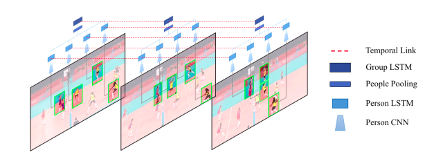
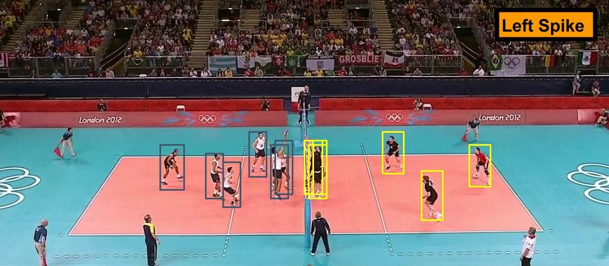
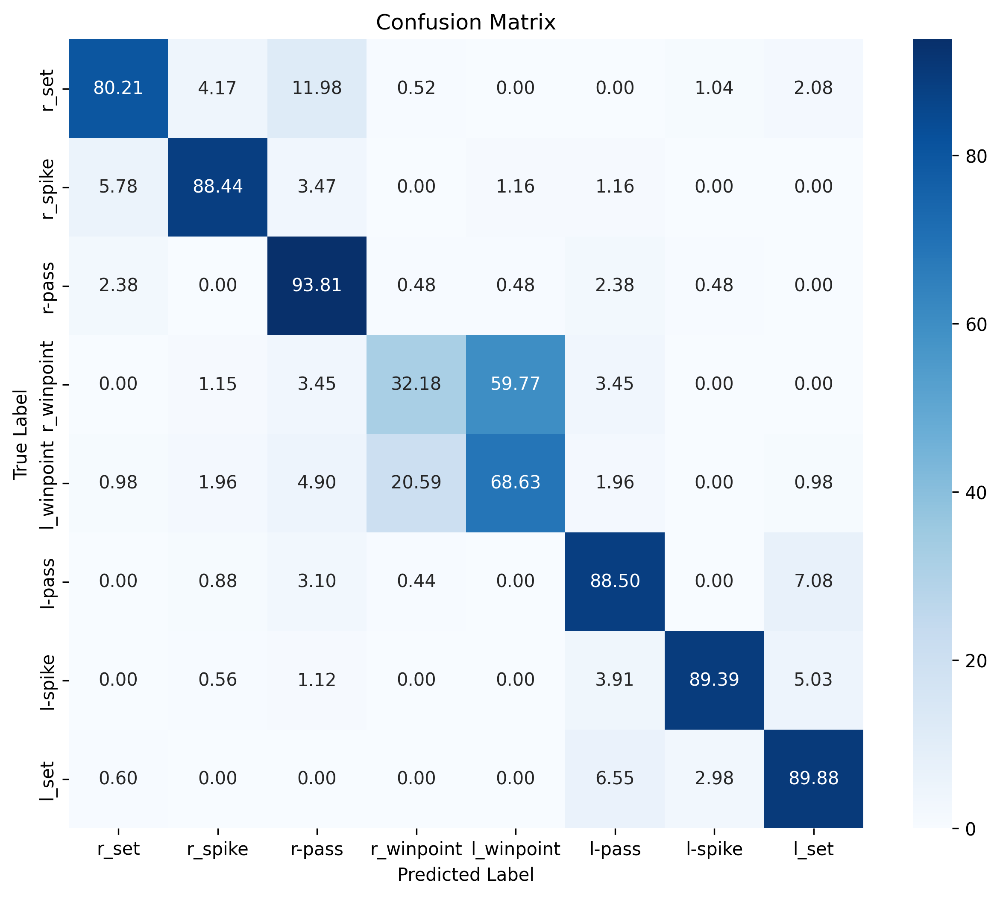
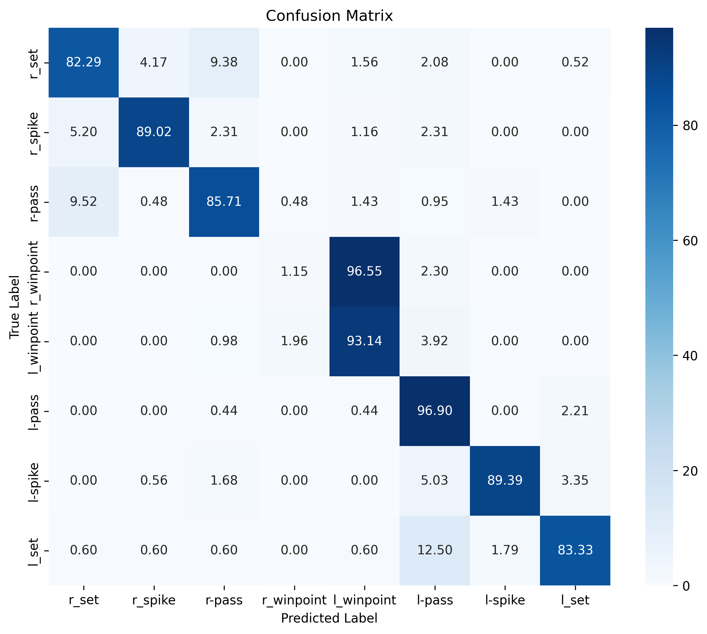
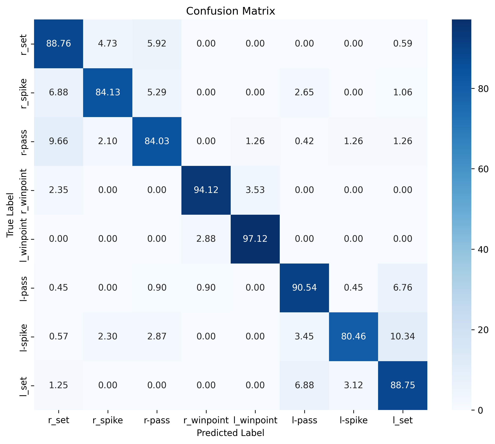

<div align="center">
  
</div>

<h1 align="center">Group Activity Recognition</h1>

<p align="center">
  A modern implementation of the <strong>CVPR 2016 paper</strong>, <a href="https://www.cv-foundation.org/openaccess/content_cvpr_2016/papers/Ibrahim_A_Hierarchical_Deep_CVPR_2016_paper.pdf"><em>A Hierarchical Deep Temporal Model for Group Activity Recognition</em></a> by <strong>Ibrahim et al.</strong>
  This approach leverages a two-stage LSTM architecture to effectively model and recognize group activities by capturing both individual actions and group-level temporal dynamics.
</p>


## Table of Contents
1. [Key Implementation Outcomes](#key-implementation-outcomes)
2. [Usage](#usage)
   - [Clone the Repository](#1-clone-the-repository)
   - [Install Dependencies](#2-install-the-required-dependencies)
   - [Download Model Checkpoint](#3-download-the-model-checkpoint)
3. [Dataset Overview](#dataset-overview)
   - [Example Annotations](#example-annotations)
   - [Dataset Statistics](#dataset-statistics)
   - [Dataset Structure and Annotations](#dataset-structure-and-annotations)
   - [Dataset Download Instructions](#dataset-download-instructions)
4. [Ablation Study](#ablation-study)
   - [Baselines](#baselines)
5. [Performance Comparison](#performance-comparison)
   - [Original Paper Baselines Score](#original-paper-baselines-score)
   - [My Scores](#my-scores)
6. [Interesting Observations](#interesting-observations)
   - [Effect of Pooling each Team Independent](#effect-of-pooling-each-team-independent)

## Key Implementation Outcomes

- <strong>ResNet50</strong> for feature extraction (replacing AlexNet).
- <strong>Ablation study</strong> to analyze model components.
- Implementation of an <strong>end-to-end version</strong>.
- Achieve <strong>higher performance</strong> across every baseline compared to the original paper.
- Full implementation in <strong>Pytorch</strong> (original one used <strong>Caffe</strong>).

## Usage

---

### 1. Clone the Repository
```bash
git clone https://github.com/HusamettinYilmazz/Group-Activity-Recognition.git
```

### 2. Install the Required Dependencies
```bash
pip3 install -r requirements.txt
```

### 3. Download the Model Checkpoint
There are 2 options to download a checkpoint

#### Option 1: Use Kaggle API (Recommended)
Replace the `modeling` directory with the downloaded one:
```python
import kagglehub

# Download the latest version
path = kagglehub.model_download("husammm/group-activity-recognition/pyTorch/v0")

print("Path to model dir:", path)
```

#### Option 2: Download a checkpoint
Browse and download the specific checkpoint from Kaggle:  
[Group Activity Recognition - Checkpoint](https://www.kaggle.com/models/husammm/group-activity-recognition/pyTorch/v0/1)

-----

## Dataset Overview
The dataset was first introduced as a part of the same mentioned paper [GitHub](https://github.com/mostafa-saad/deep-activity-rec?tab=readme-ov-file#dataset)

It was created using publicly available YouTube volleyball videos. The authors annotated 4,830 frames from 55 videos, categorizing player actions into 9 labels and team activities into 8 labels. 


### Example Annotations



- **Figure**: A frame labeled as "Left Spike," with bounding boxes around each player, demonstrating team activity annotations.


**Figure**: For each visible player, an action label is annotaed.

### Dataset Statistics

|Group Activity Class|No. of Instances|
|---|---|
|Right set|644|
|Right spike|623|
|Right pass|801|
|Right winpoint|295|
|Left winpoint|367|
|Left pass|826|
|Left spike|642|
|Left set|633|


|Action Classes|No. of Instances|
|---|---|
|Waiting|3601|
|Setting|1332|
|Digging|2333|
|Falling|1241||
|Spiking|1216|
|Blocking|2458|
|Jumping|341|
|Moving|5121|
|Standing|38696|

### Dataset Structure and Annotations
* The dataset contains 55 videos. Each video has a folder for it with unique IDs (0, 1...54)
 * **Train Videos**: 1 3 6 7 10 13 15 16 18 22 23 31 32 36 38 39 40 41 42 48 50 52 53 54
 * **Validation Videos**: 0 2 8 12 17 19 24 26 27 28 30 33 46 49 51
 * **Test Videos**: 4 5 9 11 14 20 21 25 29 34 35 37 43 44 45 47
* Inside each video directory, a set of directories corresponds to annotated frames (e.g. volleyball/39/29885)
  * Video 39, frame ID 29885
* Each frame directory has 41 images (20 images before target frame, **target frame**, 20 frames after target frame)
  * E.g. for frame ID: 29885 => Window = {29865, 29866.....29885, 29886....29905}
  * Scences change quite rapidly in volleyball, hence frames beyond that window shouldn't represent belong to target frame most of time.
  * In our work, we used 5 before and 4 after frames.
* Each video directory has annotations.txt file that contains selected frames annotations.
* Each annotation line in format: {Frame ID} {Frame Activity Class} {Player Annotation}  {Player Annotation} ...
  * Player Annotation corresponds to a tight bounding box surrounds each player
* Each {Player Annotation} in format: {Action Class} X Y W H


### Dataset Download Instructions

#### Option 1: Download using script
1. Enable Kaggle's public API. Follow the guide here: [Kaggle API Documentation](https://www.kaggle.com/docs/api).  
2. Use the provided shell script:
```bash
  chmod 600 .kaggle/kaggle.json 
  chmod +x script/script_download_volleball_dataset.sh
  .script/script_download_volleball_dataset.sh
```

#### Option 2: Download it using drive link
[Author's drive link](https://drive.google.com/drive/folders/1rmsrG1mgkwxOKhsr-QYoi9Ss92wQmCOS)

-----
## Ablation Study

### Baselines

- **B1-Image Classification:**  
   A straightforward image classifier based on ResNet-50, fine-tuned to classify group activities using a single frame from for each clip in video.

- **B3-Fine-tuned Person Classification:**  
   The ResNet-50 CNN model is deployed on each person. Feature extraction for each crop 2048 features are pooled over all people and then fed to a softmax classifier to recognize group activities in a single frame.

- **B4-Temporal Model with Image Features:**  
   A temporal model that uses image features per clip. Each clip consists of 9 frames, and an LSTM is trained on sequences of 9 steps for each clip.

- **B5-Temporal Model with Person Features:**  
   A temporal extension of the previous baseline (B3) temporal on crops (LSTM on player level), where person-specific features pooled over all individuals to recognize group activities.

- **B6-Two-stage Model without LSTM 1:**  
  Individual features pooled over all people are fed into an LSTM model to capture group dynamics.

- **B7-Two-stage Model without LSTM 2:**  
   The full model (V1) trains an LSTM on crop-level data (LSTM on a player level). Clips are extracted: sequences of 9 steps per player for each frame. A max-pooling operation is applied to the players, and LSTM 2 is trained on the frame level.

- **B8-Two-stage Hierarchical Model (End to End):**  
   The full model (V2) trains an LSTM on crop-level data (LSTM on a player level). Clips are extracted as sequences of 9 steps per player for each frame. A max-pooling operation is applied to each player's team in a dependent way. Features from both teams are concatenated along the feature dimension, and the result is fed to LSTM 2 at the frame level.

---
## Performance comparison

### Original Paper Baselines Score


### My Scores

| **Baseline** | **Accuracy** | **F1 Score** |
|--------------|--------------|--------------|
| B1-Image Classification  | 72.85%       | 72.81%       |
| B3-Fine-tuned Person Classification  | 80.98%       | 79.59%       |
| B4-Temporal Model with Image Features  | 75.62%       | 75.68%       |
| B5-Temporal Model with Person Features  | 83.25%       | 82.87%       |
| B6-Two-stage Model without LSTM 1  | 82.80%       | 80.88%       |
| B7-Two-stage Model without LSTM 2  | 84.95%       | 83.70%       |
| B8-Two-stage Hierarchical Model (End to End)  | 91.25%       | 91.26%       |

---

## Interesting Observations

### Effect of Pooling each Team Independent

The following confusion matrices from Baseline 5 and Baseline 6 reveal some interesting insights:

#### Baseline 5 Confusion Matrix


#### Baseline 6 Confusion Matrix


- The most frequent confusions occur between:
  - Right winpoint vs. left winpoint

This behavior is likely due to the pooling of the 12 players from both teams when transitioning from the individual/personal level to the frame/group level. By grouping all players into one unit, the model loses spatial and direction information regarding player positions. 

When the teams are grouped and processed seperatly before concatenation, the player position information is retained. This suggests that a more careful handling of player positions could improve model performance, as observed in Baseline 8.

#### Baseline 8 Confusion Matrix



--- 

#### Training Configuration

- **Training Platform**: The model is trained on Kaggle's free GPU quota (P100 16 RAM GPU) [Notebook](https://www.kaggle.com/code/husammm/baseline8).
- **Optimizer:** AdamW optimizer with scheduling learning rate.
- **Batch Size:** 2