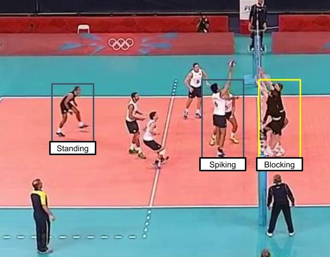
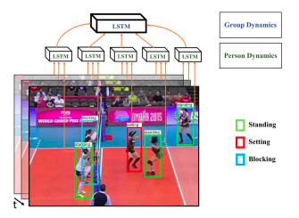
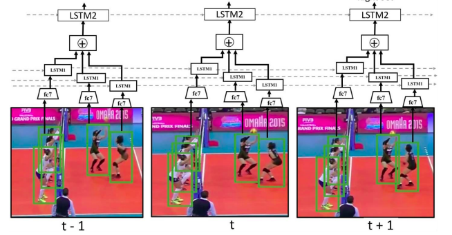
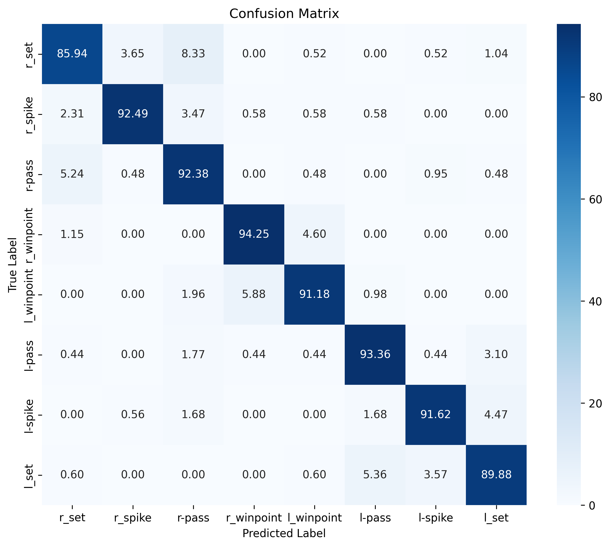

<div align="center">
  
</div>

<h1 align="center">Group Activity Recognition</h1>

<p align="center">
  A modern implementation of the <strong>CVPR 2016 paper</strong>, <a href="https://www.cv-foundation.org/openaccess/content_cvpr_2016/papers/Ibrahim_A_Hierarchical_Deep_CVPR_2016_paper.pdf"><em>A Hierarchical Deep Temporal Model for Group Activity Recognition</em></a> by <strong>Ibrahim et al.</strong>
  This approach leverages a two-stage LSTM architecture to effectively model and recognize group activities by capturing both individual actions and group-level temporal dynamics.
</p>


## Table of Contents
1. [Key Implementation Outcomes](#key-implementation-outcomes)
2. [Usage](#usage)
   - [Clone the Repository](#1-clone-the-repository)
   - [Install Dependencies](#2-install-the-required-dependencies)
   - [Download Model Checkpoint](#3-download-the-model-checkpoint)
3. [Dataset Overview](#dataset-overview)
   - [Example Annotations](#example-annotations)
   - [Dataset Statistics](#dataset-statistics)
   - [Dataset Structure and Annotations](#dataset-structure-and-annotations)
   - [Dataset Download Instructions](#dataset-download-instructions)
4. [Ablation Study](#ablation-study)
   - [Baselines](#baselines)
5. [Performance Comparison](#performance-comparison)
   - [Original Paper Baselines Score](#original-paper-baselines-score)
   - [My Scores](#my-scores)
6. [Interesting Observations](#interesting-observations)
   - [Effect of Pooling each Team Independent](#effect-of-pooling-each-team-independent)

## Key Implementation Outcomes

- <strong>ResNet50</strong> for feature extraction (replacing ResNet-50).
- <strong>Ablation study</strong> to analyze model components.
- Implementation of an <strong>end-to-end version</strong>.
- Achieve <strong>higher performance</strong> across every baseline compared to the original paper.
- Full implementation in <strong>Pytorch</strong> (original one used <strong>Caffe</strong>).

## Usage

---

### 1. Clone the Repository
```bash
git clone https://github.com/HusamettinYilmazz/Group-Activity-Recognition.git
```

### 2. Install the Required Dependencies
```bash
pip3 install -r requirements.txt
```

### 3. Download the Model Checkpoint
There are 2 options to download a checkpoint

#### Option 1: Use Kaggle API (Recommended)
Replace the `modeling` directory with the downloaded one:
```python
import kagglehub

# Download the latest version
path = kagglehub.model_download("https://www.kaggle.com/models/husammm/GAR-Baseline_8/pyTorch/V1")

print("Path to model dir:", path)
```

#### Option 2: Download a checkpoint
Browse and download the specific checkpoint from Kaggle:  
[Group Activity Recognition - Checkpoint](https://www.kaggle.com/models/husammm/group-activity-recognition/pyTorch/)

-----

## Dataset Overview
The dataset was first introduced as a part of the same mentioned paper [GitHub](https://github.com/mostafa-saad/deep-activity-rec?tab=readme-ov-file#dataset)

It was created using publicly available YouTube volleyball videos. The authors annotated 4,830 frames from 55 videos, categorizing player actions into 9 labels and team activities into 8 labels. 


### Example Annotations


- **Figure**: A frame labeled as "Left Spike," with bounding boxes around each player, demonstrating team activity annotations.


- **Figure**: For each visible player, an action label is annotated.

### Dataset Statistics

|Group Activity Class|No. of Instances|
|---|---|
|Right set|644|
|Right spike|623|
|Right pass|801|
|Right winpoint|295|
|Left winpoint|367|
|Left pass|826|
|Left spike|642|
|Left set|633|


|Action Classes|No. of Instances|
|---|---|
|Waiting|3601|
|Setting|1332|
|Digging|2333|
|Falling|1241||
|Spiking|1216|
|Blocking|2458|
|Jumping|341|
|Moving|5121|
|Standing|38696|

### Dataset Structure and Annotations
* The dataset contains 55 videos. Each video has a folder for it with unique IDs (0, 1...54)
 * **Train Videos**: 1 3 6 7 10 13 15 16 18 22 23 31 32 36 38 39 40 41 42 48 50 52 53 54
 * **Validation Videos**: 0 2 8 12 17 19 24 26 27 28 30 33 46 49 51
 * **Test Videos**: 4 5 9 11 14 20 21 25 29 34 35 37 43 44 45 47
* Inside each video directory, a set of directories corresponds to annotated frames (e.g. volleyball/39/29885)
  * Video 39, frame ID 29885
* Each frame directory has 41 images (20 images before target frame, **target frame**, 20 frames after target frame)
  * E.g. for frame ID: 29885 => Window = {29865, 29866.....29885, 29886....29905}
  * Scences change quite rapidly in volleyball, hence frames beyond that window shouldn't represent belong to target frame most of time.
  * In our work, we used 5 before and 4 after frames.
* Each video directory has annotations.txt file that contains selected frames annotations.
* Each annotation line in format: {Frame ID} {Frame Activity Class} {Player Annotation}  {Player Annotation} ...
  * Player Annotation corresponds to a tight bounding box surrounds each player
* Each {Player Annotation} in format: {Action Class} X Y W H


### Dataset Download Instructions

#### Option 1: Download using script
1. Enable Kaggle's public API. Follow the guide here: [Kaggle API Documentation](https://www.kaggle.com/docs/api).  
2. Use the provided shell script:
```bash
  chmod 600 .kaggle/kaggle.json 
  chmod +x script/script_download_volleball_dataset.sh
  .script/script_download_volleball_dataset.sh
```

#### Option 2: Download it using drive link
[Author's drive link](https://drive.google.com/drive/folders/1rmsrG1mgkwxOKhsr-QYoi9Ss92wQmCOS)

-----
## Ablation Study

### Baselines

- **B1-Image Classification:**  
   This baseline is the basic ResNet-50 model fine-tuned for group activity recognition in a single frame.

- **B3-Fine-tuned Person Classification:**  
   This baseline is similar to the previous baseline with one distinction. The ResNet-50 model on each player is fine-tuned to recognize person-level actions. Then, feature vector is pooled over all players to recognize group activities in a scene without any fine-tuning of the ResNet-50 model. The rational behind this baseline is to examine a scenario where person-level action annotations as well as group activity annotations are used in a deep learning model that does not model the temporal aspect of group activities. This is very similar to our two-stage model without the temporal modeling.

- **B4-Temporal Model with Image Features:**  
   This baseline is a temporal extension of the first baseline. It examines the idea of feeding image level features directly to a LSTM model to recognize group activities. In this baseline, the ResNet-50 model is deployed on the whole image and resulting features are fed to a LSTM model.

- **B5-Two-stage Model without without LSTM2:**  
   This baseline is a variant of the final model, omitting the group-level temporal model (LSTM 2). In other words, the final classification is done based on the outputs of the temporal models for individual person action labels, but without an additional group-level LSTM.

- **B6-Two-stage Model without LSTM 1:**  
  This baseline is a variant of the final model, omitting the person-level temporal model (LSTM 1). Instead, the person-level classification is done only with the fine-tuned person CNN.

- **B7-Two-stage Hierarchical Model (End to End):**  
   This baseline is a full model (V1) trains an LSTM on crop-level data (LSTM on a player level). sequence are extracted of 9 steps per player for each frame then, Pooling operation is applied to the players then, LSTM 2 is trained on the pooled frame level.

   <p align="center">
    
   </p>

- **B8-Two-stage Hierarchical Model (each team features pooled independent):**  
   This baseline is a full model (V2) trains an LSTM on crop-level data (LSTM on a player level). sequence are extracted of 9 steps per player for each frame then, a pooling operation is applied to each team's players in an independent way from other team. Features from both teams are concatenated to creat frame level representation then, fed to LSTM 2 to get frame level action.

   <p align="center">
    
   </p>
---
## Performance comparison

### Original Paper Baselines Score


### My Scores

| **Baseline** | **Accuracy** | **F1 Score** |
|--------------|--------------|--------------|
| B1-Image Classification  | 72.85%       | 72.81%       |
| B3-Fine-tuned Person Classification  | 80.98%       | 79.59%       |
| B4-Temporal Model with Image Features  | 75.62%       | 75.68%       |
| B5-Temporal Model with Person Features  | 83.25%       | 82.87%       |
| B6-Two-stage Model without LSTM 1  | 82.80%       | 80.88%       |
| B7-Two-stage Model without LSTM 2  | 84.95%       | 83.70%       |
| B8-Two-stage Hierarchical Model (End to End)  | 91.25%       | 91.26%       |

---

## Interesting Observations

### Effect of Pooling each Team Independent

The following confusion matrices from Baseline 5 and Baseline 6 reveal some interesting insights:

#### Baseline 5 Confusion Matrix


#### Baseline 6 Confusion Matrix


- The most frequent confusions occur between:
  - Right winpoint vs. Left winpoint

The observed performance degradation can be attributed to the aggregation of all 12 players—across both teams—during the transition from player-level to frame-level representation via pooling. This approach inherently discards spatial and directional information critical to understanding inter-player dynamics.

By contrast, processing players from each team independently prior to concatenation preserves intra-team spatial structure and relative positioning. This design choice, as implemented in Baseline 8, highlights the importance of maintaining structured spatial information, suggesting that more granular handling of player positions can lead to improved model fidelity and overall performance.

#### Baseline 8 Confusion Matrix



--- 

#### Training Configuration

- **Training Platform**: The model is trained on Kaggle's free GPU quota (P100 16 RAM GPU) [Notebook](https://www.kaggle.com/code/husammm/baseline8).
- **Optimizer:** AdamW optimizer with scheduling learning rate.
- **Batch Size:** 2